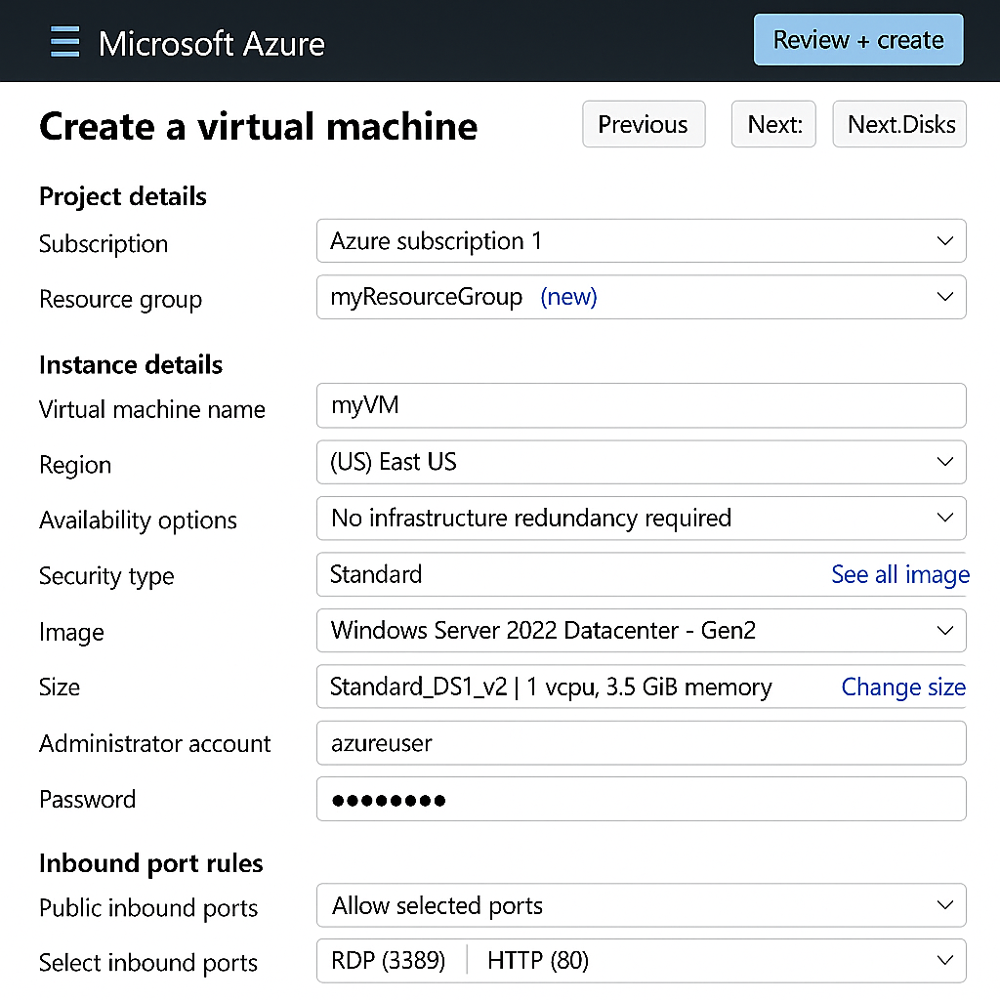

# 🚀 Laboratório Azure: Criação de Máquinas Virtuais

  

**Documentação prática para implementação e configuração de VMs na Microsoft Azure**

*Autor: Tabata Gonzales*

---

## 📋 Índice

- [Sobre o Projeto](#sobre-o-projeto)
- [Pré-requisitos](#pré-requisitos)
- [Passo a Passo](#passo-a-passo)
- [Configurações Importantes](#configurações-importantes)
- [Capturas de Tela](#capturas-de-tela)
- [Lições Aprendidas](#lições-aprendidas)
- [Referências](#referências)

## 📖 Sobre o Projeto

Este repositório documenta minha experiência prática com a criação de máquinas virtuais na Microsoft Azure, explorando conceitos de computação em nuvem, escalabilidade e eficiência. O projeto abrange desde a criação básica até configurações avançadas, incluindo instalação do IIS e conectividade RDP.

### 🛠️ Tecnologias Utilizadas

- **Microsoft Azure** - Plataforma de nuvem
- **Windows Server 2022** - Sistema operacional da VM

## ✅ Pré-requisitos

Para reproduzir este laboratório, você precisa:

- ✅ Conta ativa no Microsoft Azure
- ✅ Conhecimentos básicos de Windows Server
- ✅ Acesso ao Portal do Azure

## 🚀 Passo a Passo

### 1. Acessando o Portal do Azure
1. Acesse [portal.azure.com](https://portal.azure.com)
2. Faça login com sua conta Microsoft/Azure
3. No menu principal, clique em **"Máquinas Virtuais"**
4. Selecione **"+ Criar"** → **"Máquina virtual do Azure"**

### 2. Configurações Básicas da VM
1. **Assinatura**: Selecione sua assinatura ativa
2. **Grupo de recursos**: Crie um novo ou use existente
3. **Nome da VM**: Digite um nome descritivo (ex: `vm-lab-tabata`)
4. **Região**: Escolha a região mais próxima
5. **Imagem**: Selecione **Windows Server 2022 Datacenter**
6. **Tamanho**: Escolha `Standard_B1s` (básico para laboratório)

### 3. Configuração de Conta Administrador
1. **Nome de usuário**: Digite um nome de administrador
2. **Senha**: Crie uma senha forte (min. 12 caracteres)
3. **Confirmar senha**: Digite novamente a senha

### 4. Configuração de Rede
1. **Portas de entrada**: Marque **"Permitir portas selecionadas"**
2. **Selecionar portas**: Escolha **RDP (3389)** e **HTTP (80)**
3. Mantenha as demais configurações padrão

### 5. Finalização e Criação
1. Clique em **"Examinar + criar"**
2. Aguarde a validação
3. Clique em **"Criar"** para iniciar a implantação
4. Aguarde aproximadamente 5-10 minutos

### 6. Conexão via RDP
1. Na VM criada, clique em **"Conectar"** → **"RDP"**
2. Baixe o arquivo `.rdp`
3. Execute o arquivo e insira as credenciais
4. Conecte-se à máquina virtual

## 📸 Capturas de Tela

*Tela inicial de criação da máquina virtual*

## 💡 Lições Aprendidas

### ✅ Principais Aprendizados
- **Planejamento de custos**: VMs consomem recursos constantemente, importante desligar quando não usar
- **Segurança de rede**: Configurar apenas as portas necessárias nos Network Security Groups
- **Backup automático**: Configurar backups desde o início evita perda de dados

## 📚 Referências

- [Documentação oficial da Microsoft](https://learn.microsoft.com/pt-br/azure/)
- [Criar VM Windows no Portal Azure](https://learn.microsoft.com/pt-br/azure/virtual-machines/windows/quick-create-portal)
- [Melhores práticas de segurança Azure](https://learn.microsoft.com/pt-br/azure/security/)
- Material do curso DIO - Introdução ao Computador em nuvem

---

**Desenvolvido por Tabata Gonzales** 👩‍💻

[⬆ Voltar ao topo](#-laboratório-azure-criação-de-máquinas-virtuais)

